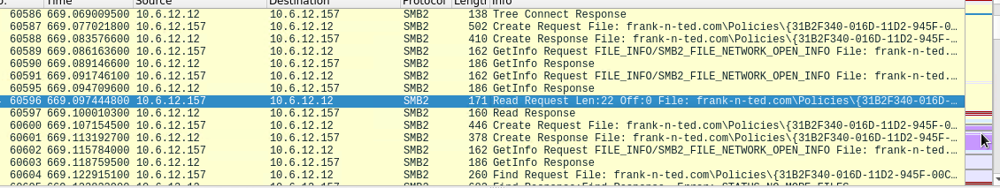

# Network Analysis

## Time Thieves

At least two users on the network have been wasting time on YouTube. Usually, IT wouldn&#39;t pay much mind to this behavior, but it seems these people have created their own web server on the corporate network. So far, Security knows the following about these time thieves:

- They have set up an Active Directory network.
- They are constantly watching videos on YouTube.
- Their IP addresses are somewhere in the range 10.6.12.0/24.

You must inspect your traffic capture to answer the following questions:

1. What is the domain name of the users&#39; custom site?
  1. Frank-n-ted.com
  2. Wireshark filter: ip.src==10.6.12.0/24

1. What is the IP address of the Domain Controller (DC) of the AD network
  1. 10.6.12.12

1. What is the name of the malware downloaded to the 10.6.12.203 machine? Once you have found the file, export it to your Kali machine&#39;s desktop.
  1. June11.dll
  2. Wireshark Filter: ip.src==10.6.12.203 and http.request.method == GET

1. Upload the file to [VirusTotal.com](https://www.virustotal.com/gui/). What kind of malware is this classified as?
  1. It is a trojan

####

####

####

## Vulnerable Windows Machines

The Security team received reports of an infected Windows host on the network. They know the following:

- Machines in the network live in the range 172.16.4.0/24.
- The domain mind-hammer.net is associated with the infected computer.
- The DC for this network lives at 172.16.4.4 and is named Mind-Hammer-DC.
- The network has standard gateway and broadcast addresses.

Inspect your traffic to answer the following questions:

1. Find the following information about the infected Windows machine:

Wireshark Filter: ip.addr == 172.16.4.0/24

- Host name: Rotterdam-PC
- IP address: 172.16.4.205
- MAC address: 00:59:07:b0:63:a4

1. What is the username of the Windows user whose computer is infected?
  - Wireshark Filter: ip.src==172.16.4.205 &amp;&amp; kerberos.CNameString
  - Username: matthijs.devries

1. What are the IP addresses used in the actual infection traffic?
  - 172.16.4.205

1. As a bonus, retrieve the desktop background of the Windows host.

## Illegal Downloads

IT was informed that some users are torrenting on the network. The Security team does not forbid the use of torrents for legitimate purposes, such as downloading operating systems. However, they have a strict policy against copyright infringement.

IT shared the following about the torrent activity:

- The machines using torrents live in the range 10.0.0.0/24 and are clients of an AD domain.
- The DC of this domain lives at 10.0.0.2 and is named DogOfTheYear-DC.
- The DC is associated with the domain dogoftheyear.net.

Your task is to isolate torrent traffic and answer the following questions:

The following Wireshark Filters were used:

- MAC Address: ip.addr == 10.0.0.201 &amp;&amp; dhcp
- Username: ip.src == 10.0.0.201 &amp;&amp; kerberos.CNameString
- Operating System: ip.addr == 10.0.0.201 &amp;&amp; http.request
- Torrent Download: ip.addr == 10.0.0.201 &amp;&amp; http.request.method == &quot;GET&quot;

1. Find the following information about the machine with IP address 10.0.0.201:
  1. MAC address: 00:16:17:18:66:c8
  2. 
  3. Windows username: blanco-desktop$
  4. 
  5. OS version: Windows NT 10.0
  6. 

1. Which torrent file did the user download?
  1. There were a few, documented below is one called Betty Boop - Rhythm on the Reservation
  2. Wireshark filter: ip.addr == 10.0.0.201 &amp;&amp; http.request.method == &quot;GET&quot;
  3. Use file: export to export the downloaded torrent
  4. 
  5. 
  6. Here&#39;s another with text describing what happens in the movie called &quot;usercomments.html&quot;
  7. 
  8. The text says &quot;Betty arrives at a reservation in her car loaded with musical instruments. The Native Americans find alternate uses for the instruments until Betty teaches them to play swing.&quot;